# 论文实验清单：arXiv:2606.21906

论文：Deeper is Not Always Better: Mitigating the Alignment Tax via Confident Layer Decoding

信息来源：
- Hugging Face paper markdown：`https://huggingface.co/papers/2606.21906.md`
- arXiv HTML 原文：`https://arxiv.org/html/2606.21906`
- arXiv PDF：`https://arxiv.org/pdf/2606.21906`
- 本仓库入口：`eval/sh/run_all_benchmarks_vllm_openai.sh` 和 `eval/` 子目录
- 原文图片已保存到：`docs/assets/paper_figures/`

说明：
- 下文只列实验。
- “本仓库入口”只按当前仓库文件判断。
- 论文有多张表重复报告同类结果，Table 1、Table 9、Table 10 的若干数值不完全一致；论文未明确这些差异是否来自不同运行、不同统计口径或不同评测配置。

## 本仓库 eval 对应关系

| 论文 benchmark / 实验 | 本仓库入口 | 对应状态 |
|---|---|---|
| GPQA-Diamond | `bash eval/sh/run_all_benchmarks_vllm_openai.sh <model> gpqa`；内部脚本 `eval/gpqa/baselines/run_baseline_diamond_vllm.py` | 可对应 |
| HLE | `bash eval/sh/run_all_benchmarks_vllm_openai.sh <model> hle`；内部脚本 `eval/hle/hle_eval/run_hle_pipeline.py` | 可对应；judge 需外部 API |
| LiveCodeBench v6 | `bash eval/sh/run_all_benchmarks_vllm_openai.sh <model> lcb`；内部入口 `python -m lcb_runner.runner.main` | 可对应 |
| LongBench v2 | `bash eval/sh/run_all_benchmarks_vllm_openai.sh <model> longbench`；内部脚本 `eval/LongBench/pred_openai.py` | 可对应 |
| Omni-MATH | `bash eval/sh/run_all_benchmarks_vllm_openai.sh <model> omni`；内部脚本 `eval/omni-math-rule/run_test_pipeline.py` | 基本对应；仓库路径叫 `omni-math-rule`，是否等同论文 Omni-MATH 全量/筛选，论文未明确 |
| Air-Bench 2024 | `bash eval/sh/run_all_benchmarks_vllm_openai.sh <model> airbench`；内部脚本 `eval/air-bench-2024/run_vllm.py` | 可对应；judge 需外部 API |
| WritingBench | 本仓库未见入口 | 不对应 |
| MATH 难度分层实验 | 本仓库未见入口 | 不对应 |
| 层动力学、熵轨迹、token 替换、开销实验 | 本仓库未见直接入口 | 不对应；需要额外 instrumentation，论文未给仓库脚本 |
| DoLa / SLED 对比 | 本仓库未见实现入口 | 不对应 |

## 1. 层动力学实验：Qwen3.5-35B-A3B

- 位置：主文 Figure 2。

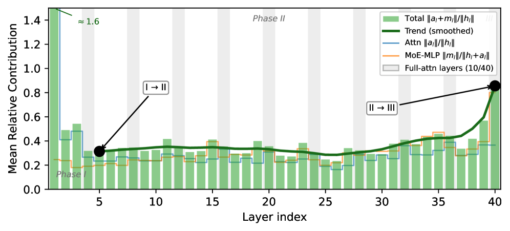

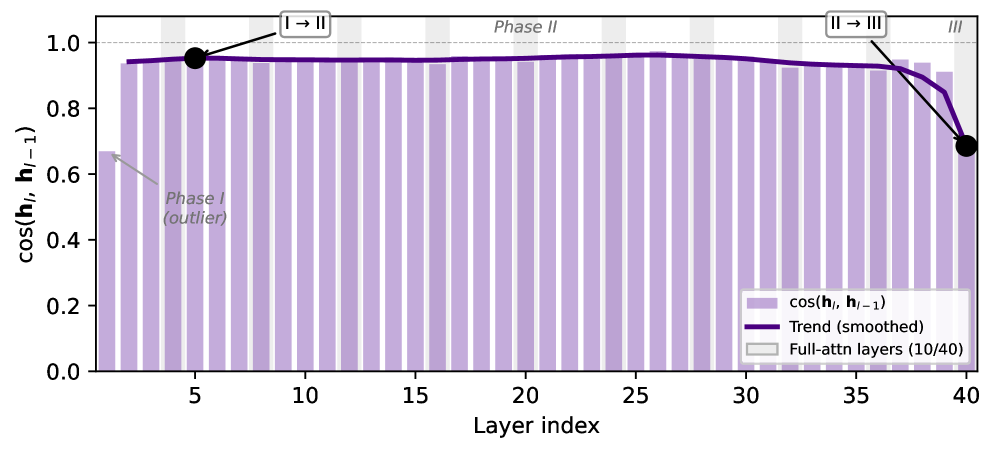

- benchmark / 数据集：GSM8K。
- 模型：Qwen3.5-35B-A3B。
- 比较方法：不是 benchmark 方法对比；按层分析 residual stream。
- 指标：Relative Contribution Norm；Residual I/O Cosine Similarity。
- 主要结论：
  - Phase I：浅层大幅改写 embedding。
  - Phase II：中间层更新较小，方向保持高一致，像逐步 refinement。
  - Phase III：最后 full-attention 层 `l=40` 更新幅度回升，IO-CosSim 降到约 `0.69`，说明最后层可能偏转已经形成的语义。
- 本仓库入口：未见直接入口。

## 2. 静态早退 vs 动态熵谷实验

- 位置：主文 Figure 3。

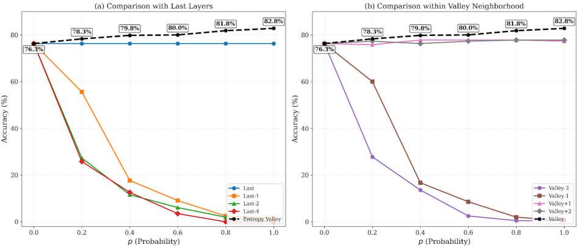

- benchmark / 数据集：GPQA-Diamond。
- 模型：Qwen3.5-35B-A3B。
- 比较方法：Last Layer、固定浅层 early exit、Entropy Valley 动态选择、`Valley +/- k` 邻近层。
- 指标：accuracy。
- 主要结论：
  - 固定 early exit 随使用概率提高会明显掉分。
  - 动态 Entropy Valley 比 last-layer 和静态 early exit 好。
  - 从 entropy valley 的相邻层解码也会掉分，说明最佳层是 token-dependent。
  - 图里没有给完整可复制数值表；具体数值论文未明确。
- 本仓库入口：GPQA 可通过 `eval/... gpqa` 跑；静态 early exit / `Valley +/- k` 消融入口未见。

## 3. 主实验：多模型多 benchmark

- 位置：主文 Table 1。
- benchmark / 数据集：GPQA-Diamond、HLE、LiveCodeBench v6、LongBench v2、Omni-MATH、Air-Bench 2024、WritingBench。
- 模型：Qwen3.5-27B、Qwen3.5-35B-A3B、Qwen3.5-122B-A10B、Gemma-4-31B、gpt-oss-20b、gpt-oss-120B。
- 比较方法：Last Layer / Greedy Decoding vs Confident Decoding。
- 指标：各 benchmark 分数，Table 1 报告为 `mean +/-` 波动。
- 主要结果：

| 模型 | 方法 | GPQA-D | HLE | LCB-v6 | LongBench-v2 | Omni-MATH | Air-Bench | WritingBench |
|---|---|---:|---:|---:|---:|---:|---:|---:|
| Qwen3.5-27B | Last Layer | 78.2±1.5 | 16.0±0.2 | 63.9±0.4 | 62.8±0.8 | 76.0±0.1 | 65.7±1.1 | 66.7±0.1 |
| Qwen3.5-27B | Confident | 79.4±1.2 | 16.8±0.4 | 73.3±0.9 | 64.9±0.8 | 76.2±0.1 | 64.7±0.6 | 66.4±0.9 |
| Qwen3.5-27B | Δ | +1.2 | +0.8 | +9.4 | +2.1 | +0.2 | -1.0 | -0.3 |
| Qwen3.5-35B-A3B | Last Layer | 76.3±0.9 | 9.2±2.1 | 70.1±0.1 | 63.2±0.6 | 72.3±0.3 | 51.7±1.1 | 65.2±0.1 |
| Qwen3.5-35B-A3B | Confident | 82.8±1.0 | 11.2±1.5 | 74.4±1.2 | 63.9±0.2 | 73.0±0.2 | 55.4±1.2 | 65.3±0.1 |
| Qwen3.5-35B-A3B | Δ | +6.5 | +2.0 | +4.3 | +0.7 | +0.7 | +3.7 | +0.1 |
| Qwen3.5-122B-A10B | Last Layer | 83.3±0.8 | 14.7±0.5 | 76.8±0.3 | 66.4±0.4 | 78.3±0.2 | 66.0±0.8 | 72.6±0.2 |
| Qwen3.5-122B-A10B | Confident | 85.4±0.7 | 16.5±0.3 | 79.2±0.5 | 66.7±0.3 | 78.5±0.1 | 67.0±0.6 | 72.7±0.3 |
| Qwen3.5-122B-A10B | Δ | +2.1 | +1.8 | +2.4 | +0.3 | +0.2 | +1.0 | +0.1 |
| Gemma-4-31B | Last Layer | 76.8±1.2 | 9.2±0.8 | 75.1±0.3 | 58.6±0.7 | 68.3±0.3 | 74.0±0.9 | 64.2±0.2 |
| Gemma-4-31B | Confident | 80.8±0.9 | 11.0±0.6 | 78.3±0.5 | 59.1±0.5 | 69.0±0.2 | 76.0±0.7 | 64.4±0.3 |
| Gemma-4-31B | Δ | +4.0 | +1.8 | +3.2 | +0.5 | +0.7 | +2.0 | +0.2 |
| gpt-oss-20b | Last Layer | 58.1±1.7 | 6.2±0.6 | 77.1±0.4 | 43.6±1.0 | 61.3±0.4 | 86.7±0.6 | 54.3±0.2 |
| gpt-oss-20b | Confident | 60.8±0.6 | 6.3±0.1 | 77.6±0.5 | 44.7±1.4 | 61.0±0.6 | 91.7±2.3 | 54.6±0.3 |
| gpt-oss-20b | Δ | +2.7 | +0.1 | +0.5 | +1.1 | -0.3 | +5.0 | +0.3 |
| gpt-oss-120B | Last Layer | 76.3±1.0 | 10.8±0.4 | 83.1±0.3 | 54.7±0.6 | 70.2±0.3 | 88.0±0.5 | 67.5±0.2 |
| gpt-oss-120B | Confident | 80.8±0.8 | 12.6±0.3 | 84.5±0.4 | 55.6±0.5 | 71.0±0.2 | 90.0±0.4 | 67.8±0.2 |
| gpt-oss-120B | Δ | +4.5 | +1.8 | +1.4 | +0.9 | +0.8 | +2.0 | +0.3 |

- 主要结论：
  - 多数模型、多个 benchmark 上 Confident Decoding 优于 Last Layer。
  - 提升集中在 GPQA-D、HLE、LCB-v6 等推理/代码任务。
  - LongBench-v2、WritingBench 提升较小；Air-Bench 大多不降，部分模型提升。
  - Qwen3.5-27B 在 Air-Bench、WritingBench 有小降；gpt-oss-20b 在 Omni-MATH 有小降。
- 本仓库入口：
  - GPQA/HLE/LCB/LongBench/Omni/AirBench 对应 `eval/sh/run_all_benchmarks_vllm_openai.sh`。
  - WritingBench 本仓库未见入口。

## 4. Instruct vs Base：验证 alignment tax

- 位置：主文 Table 2。
- benchmark / 数据集：同 Table 1 七个 benchmark。
- 模型：Qwen3.5-35B-A3B-Base；Qwen3.5-35B-A3B Instruct。
- 比较方法：Last Layer vs Confident Decoding。
- 指标：benchmark 分数和平均分。
- 主要结果：

| 模型 | 方法 | GPQA-D | HLE | LCB-v6 | LongBench-v2 | Omni-MATH | Air-Bench | WritingBench | Avg. |
|---|---:|---:|---:|---:|---:|---:|---:|---:|---:|
| Base | Last Layer | 70.3 | 8.0 | 55.0 | 59.0 | 61.3 | 67.3 | 64.0 | 55.0 |
| Base | Confident | 72.2 | 9.0 | 57.4 | 58.9 | 61.1 | 70.2 | 63.8 | 56.1 |
| Base | Δ | +1.9 | +1.0 | +2.4 | -0.1 | -0.2 | +2.9 | -0.2 | +1.1 |
| Instruct | Last Layer | 76.3 | 9.2 | 70.1 | 63.2 | 72.3 | 51.7 | 65.2 | 58.3 |
| Instruct | Confident | 82.8 | 11.2 | 74.4 | 63.9 | 73.0 | 55.4 | 65.3 | 60.9 |
| Instruct | Δ | +6.5 | +2.0 | +4.3 | +0.7 | +0.7 | +3.7 | +0.1 | +2.6 |

- 主要结论：
  - Instruct 的平均提升 `+2.6`，Base 的平均提升 `+1.1`。
  - 论文认为 post-training / alignment 会放大最后层扰动，所以 Instruct 受益更大。
  - LongBench-v2 对 Base 几乎无提升；WritingBench 基本稳定。
- 本仓库入口：
  - 六个 eval benchmark 可通过统一脚本跑。
  - Base/Instruct 两个 checkpoint 是否都在本地配置中，需看 `eval/config/model2path.json`；论文未保证。
  - WritingBench 无入口。

## 5. token 级熵谷动态

- 位置：主文 Section 6.1。
- benchmark / 数据集：论文未明确；只写 Qwen3.5-35B-A3B 的 `76,637` 个 decode steps。
- 模型：Qwen3.5-35B-A3B；另比较 Base vs Instruct 的时间位置趋势。
- 比较方法：Last Layer 是否触发 entropy rebound；Confident backward scan 是否选择非最后层。
- 指标：非平凡 entropy valley 比例、argmax 替换率、熵下降、位置分布。
- 主要结论：
  - `11.5%` token 被 backward scan 选到非最后层；valley 集中在 `L-1`。
  - 其余 `88.5%` token 最后一层已经很确定；其中 `72.0%` 的最后层熵 `<0.01`。
  - 在触发 valley 的 token 中，`21.4%` 改变 argmax；总替换率 `2.47%`。
  - 未改变 argmax 的 token 也有 entropy dispersion；平均熵下降 `43.1%`。
  - 替换集中在高熵位置：最后层熵 `<0.01` 时替换率接近 0，`[0.05,0.10)` 时约 `9.0%`，`>0.10` 时约 `14.8%`。
  - 位置上呈倒 U：非平凡 valley 率从第一 decile `9.7%` 升到 `60-70%` 处 `13.4%`，最后 decile 降到 `8.0%`；替换率从 `1.82%` 到 `3.03%` 再到 `1.47%`。
  - Instruct 在 `60-70%` 处更明显：valley `17.4%`、替换 `3.94%`；Base 为 `10.1%`、`2.24%`。
- 本仓库入口：未见直接入口。

### 主文 Figure 4：35B token 熵分区

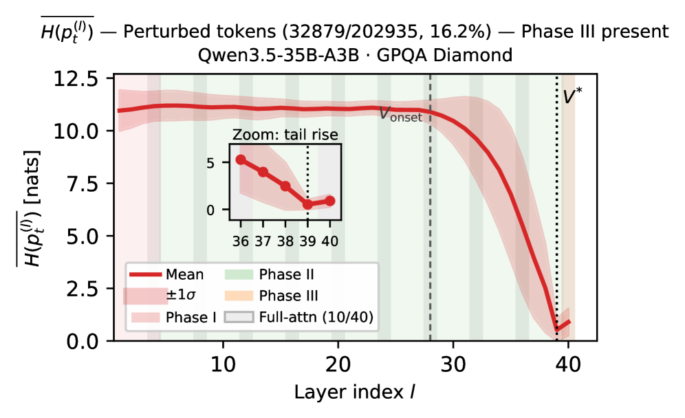

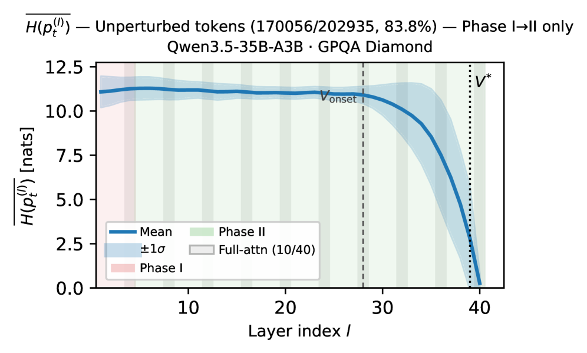

- benchmark / 数据集：GPQA-Diamond，`N=50` prompts，每个 prompt 生成 `4,096` tokens，总 `202,935` tokens。
- 模型：Qwen3.5-35B-A3B。
- 比较方法：按最后层是否让 entropy 上升，把 token 分成 perturbed / unperturbed。
- 指标：每层 mean logit-lens entropy；perturbed 比例；`Delta H`。
- 主要结论：
  - `16.2%` token 是 perturbed，最后层 entropy 上升，平均 `Delta H=+0.37 nats`。
  - `83.8%` token 是 unperturbed，最后层继续 refinement，平均 `Delta H=-2.52 nats`。
  - backward scan 对 perturbed token 选 `V*`，对 unperturbed token 选最后层。
- 本仓库入口：未见直接入口。

## 6. 难度分层实验：MATH / Omni-MATH

- 位置：主文 Section 6.2，Table 3 和 Table 4。
- benchmark / 数据集：MATH、Omni-MATH。
- 模型：gpt-oss-20b；Qwen3.5-35B-A3B。
- 比较方法：Last Layer Decoding vs Confident Decoding。
- 指标：按 baseline Pass@1 分成 Level 1-4 后的 accuracy。
- 主要结果：

| 模型 | 数据集 | 方法 | Level 1 | Level 2 | Level 3 | Level 4 |
|---|---|---|---:|---:|---:|---:|
| gpt-oss-20b | MATH | Last Layer | 98.2 | 57.1 | 30.2 | 2.1 |
| gpt-oss-20b | MATH | Confident | 97.8 | 69.8 | 56.8 | 24.6 |
| gpt-oss-20b | MATH | Δ | -0.4 | +12.7 | +26.6 | +22.5 |
| gpt-oss-20b | Omni-MATH | Last Layer | 97.0 | 55.8 | 30.8 | 1.1 |
| gpt-oss-20b | Omni-MATH | Confident | 92.7 | 59.1 | 35.3 | 23.5 |
| gpt-oss-20b | Omni-MATH | Δ | -4.3 | +3.3 | +4.5 | +22.4 |
| Qwen3.5-35B-A3B | MATH | Last Layer | 97.1 | 57.9 | 33.0 | 2.7 |
| Qwen3.5-35B-A3B | MATH | Confident | 97.0 | 79.8 | 50.0 | 11.9 |
| Qwen3.5-35B-A3B | MATH | Δ | -0.1 | +21.9 | +17.0 | +9.2 |
| Qwen3.5-35B-A3B | Omni-MATH | Last Layer | 96.0 | 56.1 | 31.7 | 0.3 |
| Qwen3.5-35B-A3B | Omni-MATH | Confident | 94.6 | 58.2 | 35.3 | 7.5 |
| Qwen3.5-35B-A3B | Omni-MATH | Δ | -1.4 | +2.1 | +3.6 | +7.2 |

- 主要结论：
  - Level 1 简单题可能小降。
  - Level 3/4 难题提升最大，尤其 gpt-oss-20b 的 Omni-MATH Level 4 从 `1.1` 到 `23.5`，提升 `+22.4`。
- 本仓库入口：
  - Omni-MATH 相关入口为 `eval/... omni`。
  - MATH 分层入口未见。
  - 分层逻辑入口未见。

## 7. 计算开销实验

- 位置：主文 Section 6.4，Table 5。
- benchmark / 数据集：论文未明确；开销基于 Qwen3.5-35B-A3B 逐 token 计算。
- 模型：Qwen3.5-35B-A3B，`L=40`，`d=2560`，`|V|=151,936`，`K=10`。
- 比较方法：普通 full forward、单次 unembedding、最坏 K=10 扫描、实际 lazy scan。
- 指标：FLOPs、相对开销、KV-cache 增量、vLLM wall-clock latency。
- 主要结果：

| 组件 | FLOPs | 相对开销 |
|---|---:|---:|
| Full Forward Pass | 5,212M | 100.00% |
| Single Unembedding Projection | 389M | +7.46% |
| Worst-case Boundary Scan, K=10 | 3,890M | +74.64% |
| Mean Extra Projections, 0.116/token | 45M | +0.87% |
| Incremental KV-Cache Memory Cost | 0 MB | +0.00% |
| End-to-End Wall-clock Latency, vLLM | 论文写 `<2% per token` | 论文未给绝对时间 |

- 主要结论：
  - 实际平均额外 projection 只有 `0.116/token`。
  - FLOPs 经验开销 `<1%`。
  - KV-cache 额外内存为 `0 MB`。
  - vLLM 端到端延迟增加 `<2%/token`。
- 本仓库入口：未见直接 benchmark 脚本。

## 8. 附录 A：评测配置

- 位置：Appendix A，Table 6。
- benchmark / 数据集：GPQA-Diamond、HLE、LiveCodeBench v6、LongBench v2、Omni-MATH、Air-Bench 2024、WritingBench。
- 模型：主实验模型。
- 比较方法：所有 benchmark 主要用 greedy / temperature `0.0`；WritingBench 用官方 leaderboard 采样配置。
- 指标：prompt、temperature、max tokens、judge。
- 主要配置：

| Benchmark | Temperature | Max Tokens | Judge | Prompt Source |
|---|---:|---:|---|---|
| GPQA-Diamond | 0.0 | 32,768 | 无 | official zero-shot |
| HLE | 0.0 | 32,768 | gpt-5.4 | official system prompt |
| LiveCodeBench v6 | 0.0 | 32,768 | 无 | official code-generation template |
| LongBench v2 | 0.0 | 32,768 CoT | 无 | official `0shot_cot` |
| Omni-MATH | 0.0 | 32,768 | rule-based | official math system prompt |
| Air-Bench 2024 | 0.0 | 512 | gpt-5.4 | official taxonomy + judge prompts |
| WritingBench | 0.7 | 16,000 | gpt-5.4 | official taxonomy + judge prompts |

- 本仓库入口：
  - 统一脚本参数基本对应前六项：GPQA/HLE/LCB/LongBench/Omni/AirBench。
  - WritingBench 未见。

## 9. 附录 A：`p` 和 temperature 消融

- 位置：Appendix A，Table 7。
- benchmark / 数据集：GPQA-Diamond。
- 模型：Qwen3.5-35B-A3B。
- 比较方法：固定 `p=1.0` 变 temperature；固定 `T=0.0` 变 valley-selection probability `p`。
- 指标：GPQA-Diamond accuracy。
- 主要结果：

| T | p | GPQA-Diamond Acc. |
|---:|---:|---:|
| 0.0 | 1.0 | 82.8 |
| 0.1 | 1.0 | 80.0 |
| 0.4 | 1.0 | 81.8 |
| 0.7 | 1.0 | 81.3 |
| 1.0 | 1.0 | 80.8 |
| 0.0 | 0.8 | 81.8 |
| 0.0 | 0.6 | 80.0 |
| 0.0 | 0.4 | 79.8 |
| 0.0 | 0.2 | 78.3 |
| 0.0 | 0.0 | 76.3 |

- 主要结论：
  - 默认 `T=0.0, p=1.0` 最好。
  - `p=0.0` 等于标准 last-layer greedy，分数 `76.3`。
  - 随着 `p` 从 `1.0` 降到 `0.0`，分数单调下降。
- 本仓库入口：GPQA 可跑；`p` 消融需要服务端 Confident Decoding 参数配合，统一 eval 脚本本身不做该消融。

## 10. 附录 B：Qwen3.5-9B 层动力学

- 位置：Appendix B.1，Figure 5。

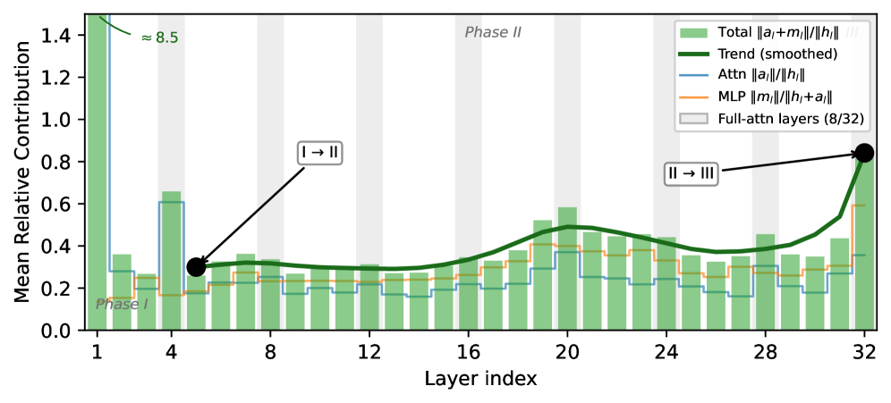

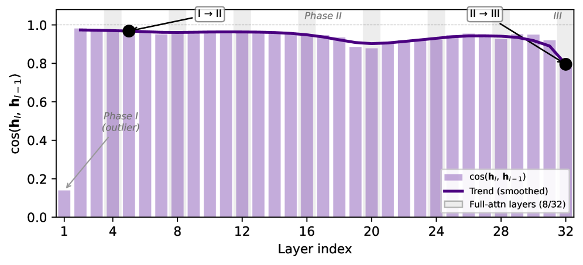

- benchmark / 数据集：GSM8K。
- 模型：Qwen3.5-9B-Base，`L=32`，24 个 DeltaNet 层 + 8 个 full-attention 层。
- 比较方法：不是解码方法对比；按层分析。
- 指标：Relative Contribution Norm；Residual I/O Cosine Similarity。
- 主要结论：
  - Phase I：`l=1`，Norm Ratio 约 `8.5`，IO-CosSim 约 `0.14`。
  - Phase II：`5 <= l <= 31`，Norm Ratio `0.26-0.58`，IO-CosSim `0.88-0.97`。
  - Phase III：`l=32`，Norm Ratio 约 `0.84`，IO-CosSim 降到约 `0.80`。
  - 论文结论：9B-Base 也有和 35B-A3B 类似的三阶段结构。
- 本仓库入口：未见直接入口。

## 11. 附录 B：Qwen3.5-9B token 熵分区

- 位置：Appendix B.2，Figure 6。

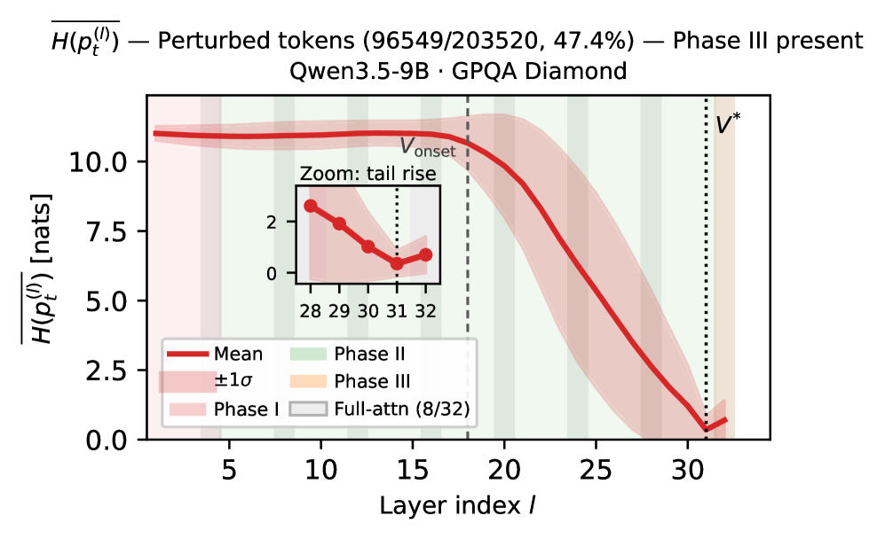

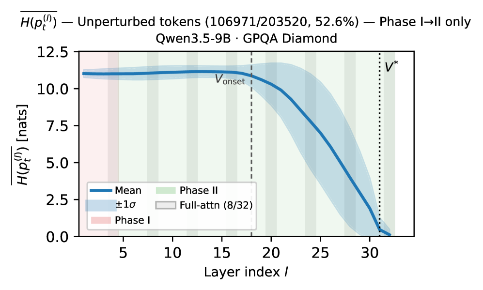

- benchmark / 数据集：GPQA-Diamond，`N=50` prompts，每个 prompt 生成 `4,096` tokens，总 `203,520` tokens。
- 模型：Qwen3.5-9B。
- 比较方法：按最后层熵是否高于前一层，把 token 分成 perturbed / unperturbed。
- 指标：perturbed token 比例；平均 `Delta H`；层级 mean logit-lens entropy。
- 主要结论：
  - 9B 上 `47.4%` token 是 perturbed，平均 `Delta H=+0.34 nats`。
  - 35B-A3B 对应比例是 `16.2%`。
  - 论文认为 9B 更浅，refinement corridor 更短，所以最后 full-attention 层更容易 overshoot。
- 本仓库入口：未见直接入口。

## 12. 附录 C：token 替换内容分析

- 位置：Appendix C，Table 8。

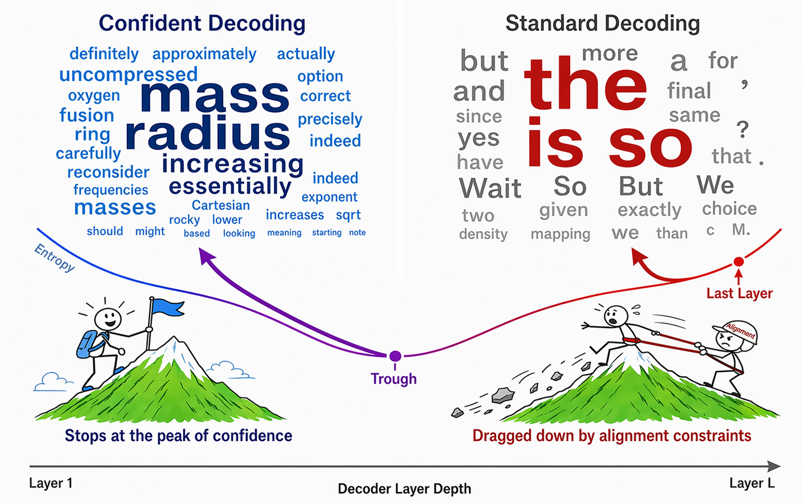

- benchmark / 数据集：GPQA-Diamond。
- 模型：Qwen3.5-35B-A3B-Base；Qwen3.5-35B-A3B Instruct。
- 比较方法：Standard / Last Layer token vs Confident / Trough token。
- 指标：替换 token 总数、替换率、top substituted tokens、类别占比。
- 主要结果：
  - Base：`956 / 40,526` tokens 被替换，替换率 `2.4%`。
  - Instruct：`939 / 36,111` tokens 被替换，替换率 `2.6%`。
  - Base 的 Last Layer 被替换 token 中，类别占比：Content `29%`，Function `39%`，Punctuation `22%`，Other `10%`。
  - Base 的 Confident 替换后 token 中，类别占比：Content `77%`，Function `10%`，Punctuation `6%`，Other `7%`。
  - Instruct 的 Last Layer 被替换 token 中，类别占比：Content `26%`，Function `27%`，Punctuation `43%`，Other `4%`。
  - Instruct 的 Confident 替换后 token 中，类别占比：Content `60%`，Function `6%`，Punctuation `26%`，Other `8%`。
  - 论文结论：Last Layer 更常输出功能词/标点，Confident 更常输出内容词。
- 本仓库入口：未见直接入口。

## 13. 附录 D：DoLa / SLED baseline 对比

- 位置：Appendix D，Table 9。
- benchmark / 数据集：GPQA-D、HLE、LCB-v6、LongBench-v2、Omni-Math、Air-Bench、WritingBench。
- 模型：Qwen3.5-35B-A3B。
- 比较方法：Last Layer、DoLa、SLED、Confident。
- 指标：benchmark 分数。
- 主要结果：

| 方法 | GPQA-D | HLE | LCB-v6 | LongBench-v2 | Omni-Math | Air-Bench | WritingBench |
|---|---:|---:|---:|---:|---:|---:|---:|
| Last Layer | 76.3 | 7.1 | 70.0 | 63.9 | 72.6 | 51.0 | 65.3 |
| DoLa | 77.3 | 7.8 | 70.9 | 63.4 | 72.4 | 52.0 | 65.2 |
| SLED | 78.8 | 7.4 | 71.7 | 63.2 | 72.1 | 53.0 | 65.3 |
| Confident | 82.8 | 9.5 | 75.1 | 63.7 | 72.7 | 56.0 | 65.4 |

- 主要结论：
  - DoLa 和 SLED 有小幅提升，但整体弱于 Confident。
  - 论文说作者重实现 DoLa/SLED 以支持 hybrid MoE；具体重实现代码未在当前仓库找到。
- 本仓库入口：未见 DoLa/SLED 入口。

## 14. 附录 E：退化分析和完整模型表

- 位置：Appendix E，Table 10。
- benchmark / 数据集：GPQA-D、HLE、LCB-v6、LongBench-v2、Omni-Math、Air-Bench、WritingBench。
- 模型：Qwen3.5-0.8B、Qwen3.5-9B、Qwen3.5-9B-Base、Qwen3.5-27B、Qwen3.5-35B-A3B、Qwen3.5-122B-A10B、Gemma-4-31B、gpt-oss-20b、gpt-oss-120B。
- 比较方法：Last Layer vs Confident。
- 指标：benchmark 分数。
- 主要结果：

| 模型 | 方法 | GPQA-D | HLE | LCB-v6 | LongBench-v2 | Omni-Math | Air-Bench | WritingBench |
|---|---:|---:|---:|---:|---:|---:|---:|---:|
| Qwen3.5-0.8B | Last Layer | 0.0 | 0.0 | 0.0 | 0.0 | 0.0 | 52.0 | 10.0 |
| Qwen3.5-0.8B | Confident | 0.0 | 0.0 | 0.0 | 0.0 | 0.0 | 54.0 | 10.1 |
| Qwen3.5-9B | Last Layer | 64.6 | 5.2 | 41.1 | 62.0 | 49.1 | 53.0 | 60.7 |
| Qwen3.5-9B | Confident | 62.1 | 6.1 | 47.7 | 60.5 | 47.1 | 56.0 | 59.5 |
| Qwen3.5-9B-Base | Last Layer | 67.7 | 5.4 | 49.1 | 54.4 | 54.7 | 76.0 | 61.1 |
| Qwen3.5-9B-Base | Confident | 65.7 | 6.3 | 50.5 | 56.1 | 53.0 | 76.0 | 63.0 |
| Qwen3.5-27B | Last Layer | 80.0 | 16.0 | 63.7 | 63.7 | 76.1 | 67.0 | 66.7 |
| Qwen3.5-27B | Confident | 80.0 | 17.0 | 73.8 | 64.0 | 76.1 | 64.0 | 66.9 |
| Qwen3.5-35B-A3B | Last Layer | 76.3 | 7.1 | 70.0 | 63.9 | 72.6 | 51.0 | 65.3 |
| Qwen3.5-35B-A3B | Confident | 82.8 | 9.5 | 75.1 | 63.7 | 72.7 | 56.0 | 65.4 |
| Qwen3.5-122B-A10B | Last Layer | 83.3 | 14.7 | 76.8 | 66.4 | 78.3 | 66.0 | 72.6 |
| Qwen3.5-122B-A10B | Confident | 85.4 | 16.5 | 79.2 | 66.7 | 78.5 | 67.0 | 72.7 |
| Gemma-4-31B | Last Layer | 76.8 | 9.2 | 75.1 | 58.6 | 68.3 | 74.0 | 64.2 |
| Gemma-4-31B | Confident | 80.8 | 11.0 | 78.3 | 59.1 | 69.0 | 76.0 | 64.4 |
| gpt-oss-20b | Last Layer | 57.1 | 5.5 | 77.4 | 44.6 | 60.9 | 86.0 | 54.4 |
| gpt-oss-20b | Confident | 60.1 | 6.4 | 78.0 | 46.3 | 61.6 | 89.0 | 54.9 |
| gpt-oss-120B | Last Layer | 76.3 | 10.8 | 83.1 | 54.7 | 70.2 | 88.0 | 67.5 |
| gpt-oss-120B | Confident | 80.8 | 12.6 | 84.5 | 55.6 | 71.0 | 90.0 | 67.8 |

- 主要结论：
  - Qwen3.5-9B 有退化：GPQA-D `64.6 -> 62.1`，Omni-Math `49.1 -> 47.1`，LongBench `62.0 -> 60.5`，WritingBench `60.7 -> 59.5`。
  - Qwen3.5-9B 同时在 LCB-v6、Air-Bench、HLE 提升。
  - Qwen3.5-27B 在 Air-Bench 退化：`67.0 -> 64.0`。
  - 论文解释为 hybrid architecture 的 layer-type probe mismatch 和模型深度不足会让 entropy valley 误选。
  - 论文承认 depth 和 MoE routing confounded，不能完全拆开各自贡献。
- 本仓库入口：
  - 表中六个 eval benchmark 可跑，但模型 checkpoint 配置需自己在 `eval/config/model2path.json` 中配置。
  - WritingBench 无入口。

## 15. 附录 E：token entropy 可视化

- 位置：Appendix E，Figures 7-12。

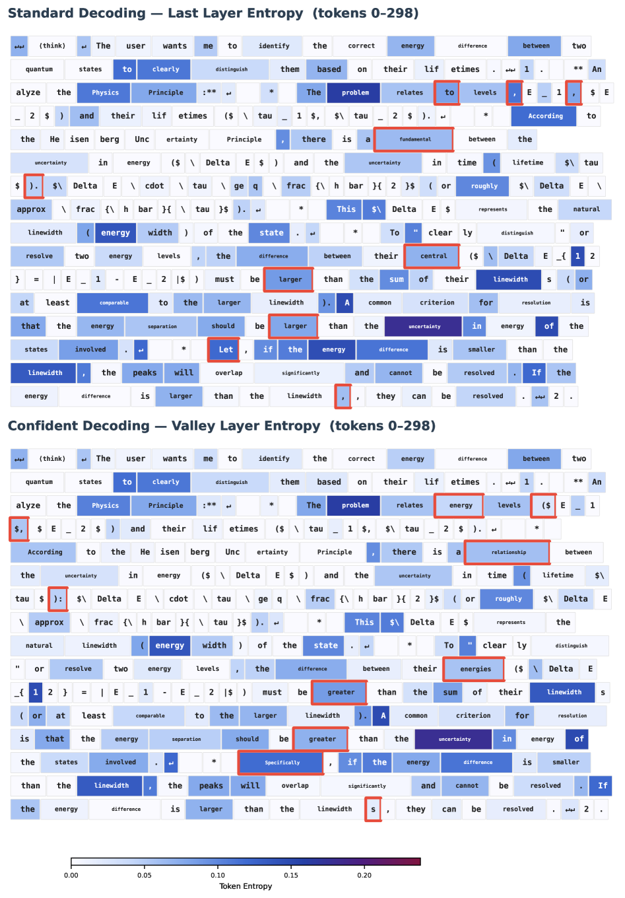

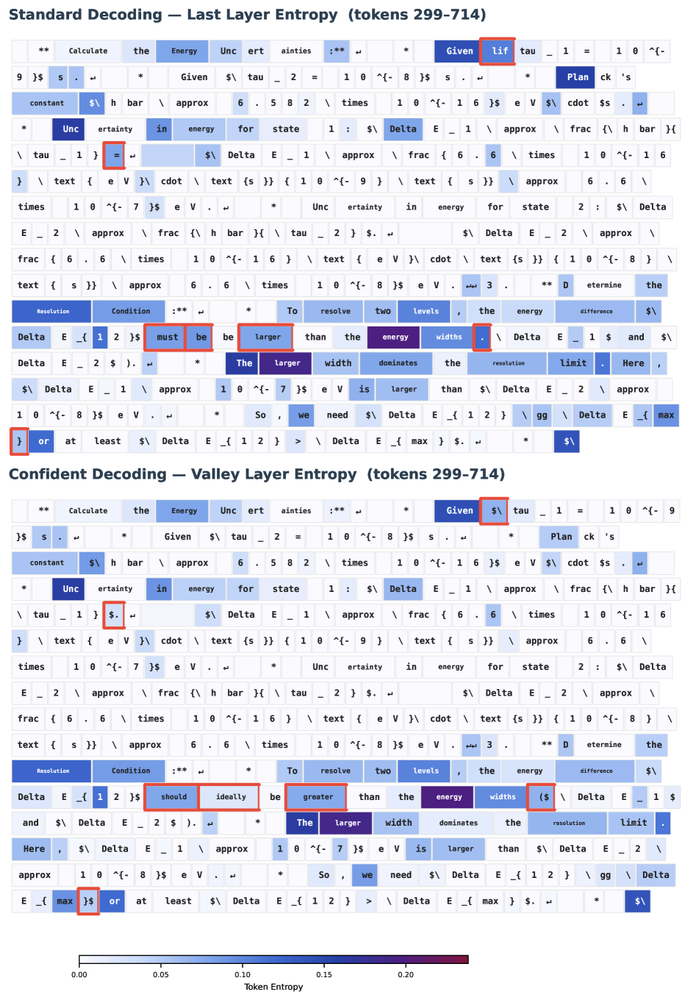

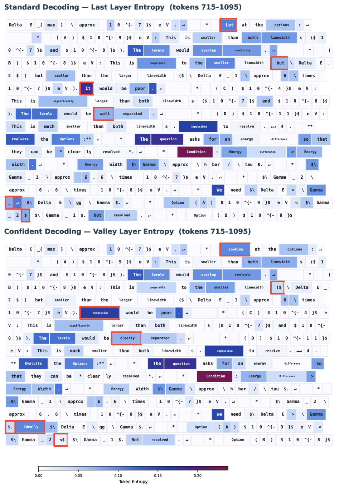

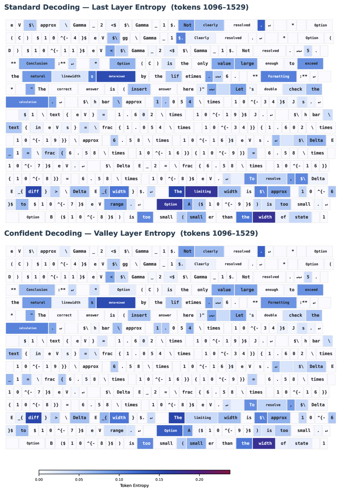

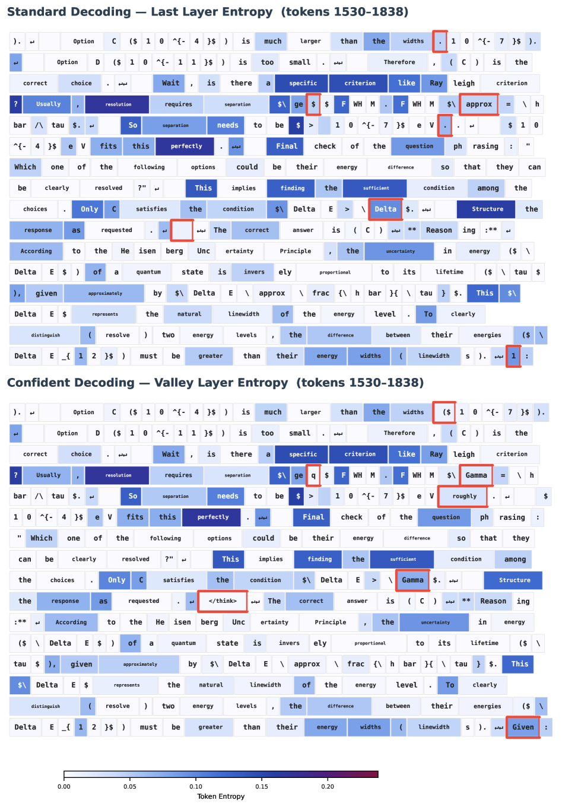

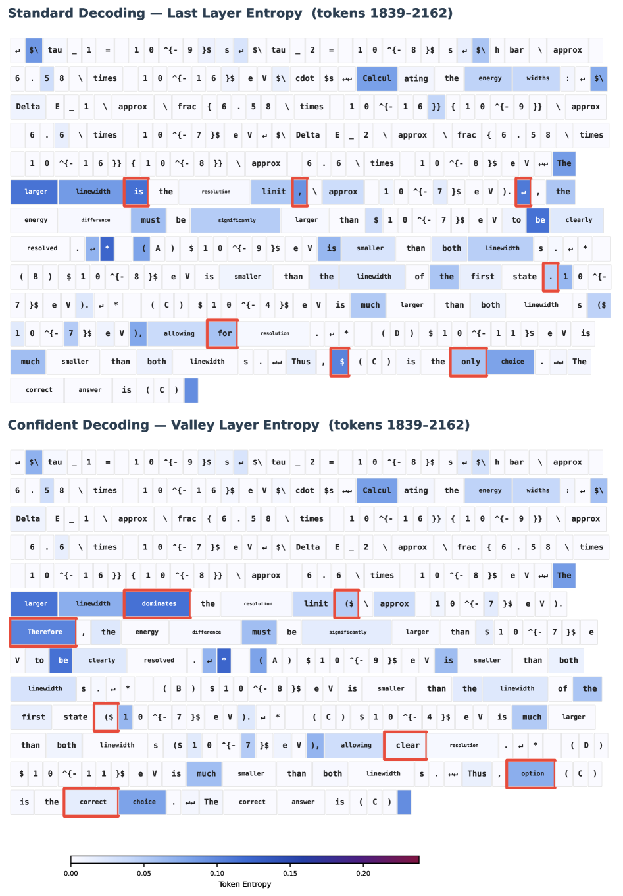

- benchmark / 数据集：论文图注只写 token entropy visualization；具体 benchmark / prompt / 模型在图注中未明确。
- 模型：论文未明确。
- 比较方法：可视化不同 token 在层间的 entropy 轨迹。
- 指标：每层 token entropy。
- 主要结论：
  - 这些图用于支持：entropy valley 通常离最后层不超过 5 层，所以 `K=10` 覆盖大多数情况。
  - 具体样本、数值和生成文本上下文，论文未明确。
- 本仓库入口：未见直接入口。

## 不能从论文确认的事项

- Table 1、Table 9、Table 10 中同一模型/benchmark 的部分数值不同，论文未明确是否是不同 run、不同 judge、不同 prompt、不同样本或是否带多次运行统计。
- Section 6.1 的 `76,637` decode steps 来自哪个 benchmark/数据集，论文未明确。
- Appendix E Figures 7-12 的具体模型、benchmark、prompt 样本，图注未明确。
- 本仓库 `omni-math-rule` 与论文 Omni-MATH 的完全一致性，论文未明确。
- 本仓库是否包含论文用的 WritingBench、MATH 分层、DoLa/SLED 重实现、层动力学 instrumentation，当前文件树中未见。
- HLE/Air-Bench/WritingBench 使用的 `gpt-5.4` judge 是否可外部复现，论文未说明可访问方式。
